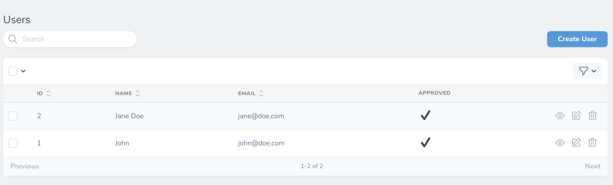

## Nova Icon
This package allows you to render a SVG icon as a custom field.


### Installation
```bash
composer require scadini/nova-icon
```

### Usage
```php
use NovaIcon\Icon;
```

```php
public function fields()
{
    return [
        ID::make()->sortable(),

        Text::make('Name'),

        Icon::make('Approved')
            ->icon('entypo:check'),
    ];
}
```

