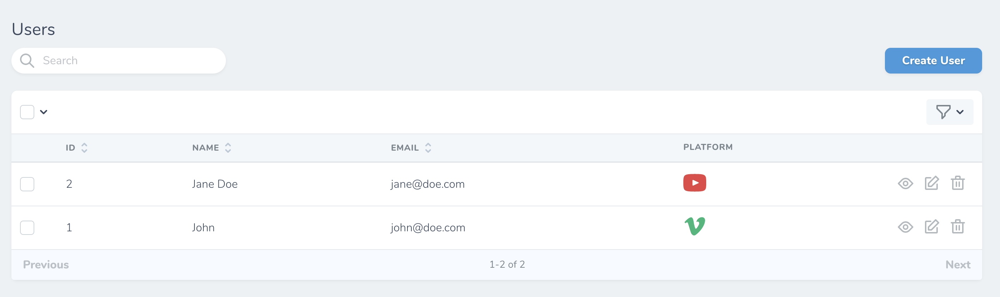

## Nova Icon
This package allows you to render a SVG icon as a custom field.

[Available Icons](#available-icons)
___
### Installation
```bash
composer require scadini/nova-icon
```

### Usage
```php
use NovaIcon\Icon;
```

```php
public function fields()
{
    return [
        ID::make()->sortable(),

        Text::make('Name'),

        Icon::make('Approved')
            ->icon('entypo:check'),
    ];
}
```


___
The simplest way to add an icon is by using the `icon()` method. 
This method accepts either a string or a closure containing the **vendor name** and the **icon name** separated by a **colon**:

````php
    Icon::make('Approved')->icon('entypo:check');
````

````php
    Icon::make('Approved')->icon(function () {
        return 'entypo:check';
    });
````

To apply css classes, you can chain the `css()` method. This method accepts a string, an array, or a closure:

````php
    Icon::make('Approved')->icon('entypo:check')->css('text-info h-12 w-12');

    Icon::make('Approved')->icon('entypo:check')->css(['text-info', 'h-12', 'w-12']);

    Icon::make('Approved')
        ->icon('entypo:check')
        ->css(function () {
            return 'text-info h-12 w-12'; // or ['text-info', 'h-12', 'w-12']
        }
    );
````

To hide an icon for a specific row, you can use the `hide()` method. This method accepts a closure:

````php
    Icon::make('Approved')
        ->icon('entypo:check')
        ->hide(function () {
            return $this->role === 'admin';
        });
````

### Example

Here's an example about using this component. Let's say a user has a preferred internet platform:

```php
    Icon::make('Platform')
        ->icon(function () {
            return 'entypo:' . $this->platform;
        })
        ->css(function () {
            $options = [
                'youtube' => 'text-danger',
                'vimeo'   => 'text-success'
            ];

            return $options[$this->platform];
        })
```



---
## Available Icons

The icons available are separated by their vendor name.

Currently, the only vendor available is [Entypo](http://www.entypo.com/), 
but there are plans to include [Zondicons](https://www.zondicons.com/icons.html) library.

For the icon names you can use [this reference table](https://github.com/hypermodules/entypo#icon-names)
